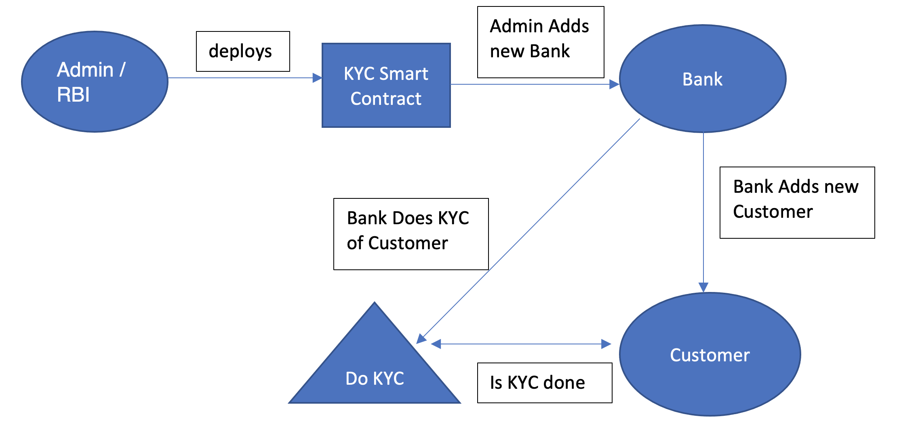

# Decentralized KYC Verification Process for Banks

## Introduction –

KYC is the control procedure, regulatory and compliance obligation that financial
institutions apply to existing and new customers to identify and prevent risks. Banks
ask their customers to fill KYC document so that they can verify their identity. Bank
crosschecks the information submitted by clients to stop money laundering, terrorist
financing, and financial frauds.

The blockchain based decentralized architecture may provide to solve KYC
problems in a modern and an elegant way forward with immutability and security
features like –

- Cost saving for the financial institutions
- Faster onboarding process
- Better customer experience
- Transparency and immutability for customer data
- Greater operational efficiency
- Real time up-to-date customer data
- Faster compliance to change KYC regulations

## Approach and Implementation –

There are 3 stakeholders –
1.	Admin / RBI – User who deploys the KYC smart contract. Has the ability to add New Banks, bans/permits bank to do KYC or add new customer.
2.	Banks – They can add new customers to the database and have the ability to do KYC of customers based on their permission.
3.	Customers – Users who have accounts with the Banks. They need to provide all the details to get added in a Bank and after successful registration gets a new unique Account Number.

Admin/RBI deploys the KYC smart contract. It will contain the mapping for all Banks added to the database wrt their addresses and mapping for all the customers present with their details wrt their Account Number like customer address, PAN number, Bank Account, phone number, etc. When new Bank is added by default they have permission to add new Customer and do KYC for them unless RBI/Admin explicitly bans them.

Only Banks can add a new customer given they have the permission and after a new customer is successfully added a unique Account number is provided to that customer. By this mechanism the same customer with same Name can have multiple accounts in different banks as they will get a unique account number to handle their account. Unique Account Number is a global variable and gets incremented by 1 whenever a new customer is added by the bank to the database.

By default KYC is set to Not Exist state for all the new customers unless KYC is processed by the Bank. KYC can only be done by the Banks given they have the permission, and once KYC is completed for a customer the KYC count for that Bank is incremented by 1. To complete KYC customer needs to provide their unique account number to the Bank.

Anyone can check if the KYC is done or not for a customer, by this making it convenient for all to retrieve information quickly and relying on single source of truth. Banks and RBI can also get all the details related to a customer by providing the account number.

## Working flow –

## Conclusion –

Through the new Decentralized KYC process RBI and Banks can quickly do KYC and verify the KYC status of any customer. It becomes convenient and reliable for all the stakeholders to participate in this process and securely trust the single source of truth leveraged by Blockchain and Smart Contract technology.
